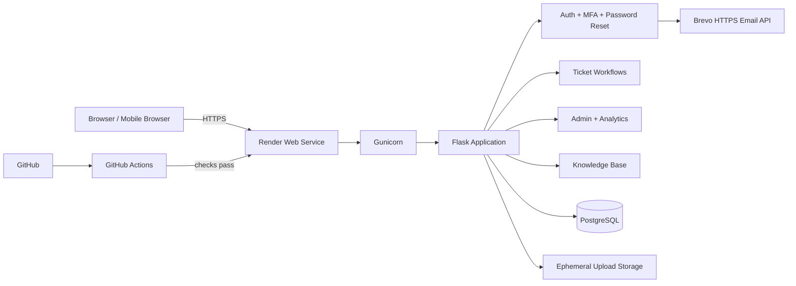

# NexusDesk

**Production-style IT help desk and ticket management platform built with Flask, PostgreSQL, Docker, GitHub Actions, Render, and transactional email.**

**Live portfolio demo:** https://nexusdesk-helpdesk.onrender.com

> The public deployment is a portfolio/demo environment populated with synthetic data. It is not intended to store real business or customer information.

## Overview

NexusDesk is a full-stack help desk system designed around the workflows commonly found in internal IT support teams. Employees can submit and track support tickets while administrators can triage requests, assign technicians, manage users, monitor SLAs, review audit activity, and maintain account security.

The project began as a local Flask application and was progressively hardened through a complete SDLC-style productionization process: architecture cleanup, automated testing, security controls, PostgreSQL migration, Dockerization, CI, cloud deployment, transactional email, synthetic portfolio data, and public acceptance testing.

## Core Features

### Authentication & security

- Password hashing with Werkzeug
- Email-based multi-factor authentication
- Password-reset tokens with expiration and one-time use
- Case-insensitive account-recovery email lookup
- Login lockout and rate limiting
- CSRF protection
- Role-based access control
- Secure production session cookies
- HSTS, CSP, frame protection, MIME protection, referrer policy, and permissions policy
- Audit logging
- Security cleanup tooling

### Ticket management

- Employee ticket submission
- Open / In Progress / Closed lifecycle
- High / Medium / Low priorities
- Ticket categories
- Technician assignment
- SLA tracking and SLA outcomes
- Ticket notes
- File attachment workflow
- Search and filtering
- Resolution tracking
- Admin ticket management

### User and support operations

- Admin and employee roles
- User creation, editing, and deletion
- Department management
- User profile management
- Knowledge base
- Knowledge-base views and feedback
- Notifications and ticket activity
- Operational dashboards and analytics

### Portfolio demonstration data

The public demo can automatically seed a deterministic synthetic dataset that includes:

- 14 fictional demo users
- 72 synthetic support tickets
- 174 ticket notes
- 224 login events
- 174 synthetic audit events plus a seed marker
- 120 knowledge-base views
- 28 knowledge-base feedback records

Synthetic users use the `demo_` prefix and `example.com` email addresses. The seed is idempotent so redeploying the application does not duplicate the dataset.

## Architecture



A deeper architecture walkthrough is available in [`docs/ARCHITECTURE.md`](docs/ARCHITECTURE.md).

## Technology Stack

| Layer | Technology |
|---|---|
| Backend | Python 3.12, Flask |
| Application server | Gunicorn |
| Database | PostgreSQL |
| Local development | Docker Compose |
| Frontend | HTML, CSS, Jinja2 |
| Security | Flask-WTF, CSRF, password hashing, MFA, rate limiting |
| Email | Brevo transactional email over HTTPS; SMTP fallback for local development |
| Testing | pytest, coverage |
| CI | GitHub Actions |
| Cloud demo | Render |
| Source control | Git + GitHub |

## Repository Structure

```text
nexusdesk-helpdesk/
├── app.py
├── routes/
├── services/
├── database/
├── templates/
├── static/
├── scripts/
├── tests/
├── deployment/
├── .github/workflows/
├── Dockerfile
├── docker-compose.yml
├── render.yaml
└── README.md
```

The application separates route handling, business/service logic, database access, and presentation templates instead of keeping the application in a single monolithic Flask file.

## Local Development

### Requirements

- Docker Desktop
- Git

Clone the repository:

```bash
git clone https://github.com/Chrisramos2101/nexusdesk-helpdesk.git
cd nexusdesk-helpdesk
```

Start the local PostgreSQL-backed application:

```bash
docker compose up --build
```

Then open:

```text
http://localhost:5000
```

Stop the application with:

```bash
docker compose down
```

Do not use `docker compose down -v` unless you intentionally want to remove the local PostgreSQL volume.

## Environment Configuration

Never commit real secrets.

Use `.env.production.example` as a reference for supported configuration. Production secrets such as `SECRET_KEY`, `DATABASE_URL`, Brevo API credentials, and bootstrap credentials are configured directly in the cloud environment.

## Testing

Run the complete Python test suite:

```bash
python -m pytest -q
```

Validate Python source:

```bash
python -m compileall -q .
```

Validate Docker Compose:

```bash
docker compose config --quiet
```

The GitHub Actions pipeline automatically performs compilation, pytest/coverage, and a Docker build on pushes and pull requests.

## Production / Portfolio Deployment

The current portfolio environment uses:

- Render Docker web service
- Render PostgreSQL
- HTTPS/TLS termination at Render
- Gunicorn
- Brevo transactional email API
- GitHub Actions
- automatic deployment after successful checks
- `/healthz` application/database health check

Public health endpoint:

```text
https://nexusdesk-helpdesk.onrender.com/healthz
```

Expected production response:

```json
{
  "application": "NexusDesk",
  "database": "postgresql",
  "status": "healthy"
}
```

## Security Design

NexusDesk uses defense-in-depth controls rather than relying on a single authentication check.

Key controls include secure cookies, CSRF protection, role authorization decorators, password hashing, rate limiting, failed-login lockout, one-time reset tokens, expiring MFA challenges, audit events, content security policy, HSTS, anti-frame protection, and restrictive browser permission headers.

See [`SECURITY.md`](SECURITY.md) for the security model and responsible-use notes.

## Cloud Demo Limitations

The public deployment intentionally uses free portfolio infrastructure.

- The service may need time to wake after inactivity.
- Free-tier upload storage is ephemeral.
- The cloud database is for synthetic/demo content rather than durable business records.
- Demo users are synthetic and are not intended as public login credentials.
- The public system should never be used for sensitive production data.

These are hosting-tier constraints, not hidden application assumptions.

## Engineering Highlights

The project demonstrates:

- migration from SQLite-oriented development to PostgreSQL
- transactional data migration and foreign-key reconciliation
- Dockerized application/database workflows
- CI automation
- production configuration validation
- cloud health monitoring
- secure reverse-proxy handling
- transactional email integration
- deterministic/idempotent demo data generation
- automated regression and public acceptance gates

A portfolio-oriented engineering summary is available in [`docs/PORTFOLIO_CASE_STUDY.md`](docs/PORTFOLIO_CASE_STUDY.md).

## Release

Current release target: **v1.0.0**

See:

- [`CHANGELOG.md`](CHANGELOG.md)
- [`docs/RELEASE_CHECKLIST.md`](docs/RELEASE_CHECKLIST.md)

## Author

**Cristian Ramos**

NexusDesk was developed as a software engineering, cloud deployment, security, and IT operations portfolio project.
