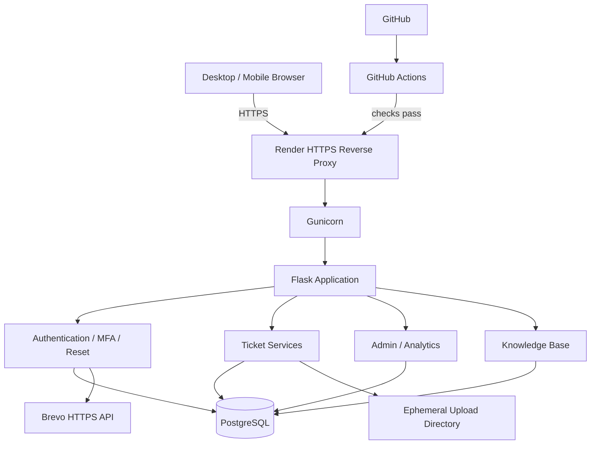
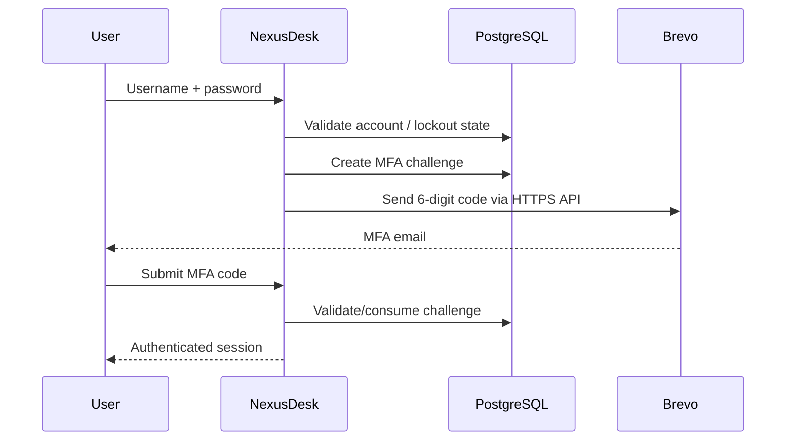

# NexusDesk Architecture

## System Context

NexusDesk is a server-rendered Flask help desk application with PostgreSQL persistence and transactional email.

## Application Layers

### Routes

Flask Blueprints define HTTP endpoints and coordinate request/response behavior.

Representative modules:

- `routes/auth.py`
- `routes/tickets.py`
- `routes/admin.py`
- `routes/dashboard.py`
- `routes/knowledge.py`

### Services

Business operations are separated into service modules.

Examples include:

- ticket operations
- user operations
- authentication/MFA
- password-reset token management
- transactional email
- validation
- audit logging
- security rate limits
- production configuration
- attachment handling

### Database

`database/` contains connection/configuration logic and schemas.

The production database is PostgreSQL. SQLite remains useful for lightweight local/test compatibility, but the production and Docker acceptance path is PostgreSQL.

### Presentation

Jinja2 templates and `static/style.css` provide the server-rendered user interface.

The same responsive web application is available from desktop and mobile browsers.

## Production Startup

The Docker entrypoint performs the following high-level sequence:

1. normalize database environment configuration
2. validate production configuration
3. prepare runtime directories
4. apply the idempotent PostgreSQL schema
5. optionally bootstrap the portfolio admin
6. optionally seed the deterministic synthetic portfolio dataset
7. execute Gunicorn

## Authentication Flow

## Password Reset Flow

1. User submits an email address.
2. NexusDesk performs a case-insensitive account lookup.
3. A cryptographically random reset token is stored with a 30-minute expiration.
4. Brevo sends a public HTTPS reset URL.
5. The token can be used once.
6. The new password is validated and hashed.
7. The token is marked used.
8. Audit activity is recorded.

The public response remains generic whether or not an account exists to reduce user enumeration risk.

## Security Boundary

Render terminates public TLS and forwards trusted proxy headers to the application. `ProxyFix` is enabled only when the deployment explicitly opts into trusted proxy headers.

Production responses include:

- HSTS
- Content-Security-Policy
- X-Frame-Options
- X-Content-Type-Options
- Referrer-Policy
- Permissions-Policy

Sessions use Secure, HttpOnly, SameSite=Lax cookies in production.

## Data Model

Major entities include:

- users
- tickets
- ticket notes
- ticket attachments
- login events
- audit logs
- password reset tokens
- MFA challenges
- security rate-limit buckets
- knowledge-base feedback
- knowledge-base views

## CI/CD

The GitHub Actions workflow:

1. checks out the repository
2. installs development dependencies
3. compiles Python source
4. runs pytest with coverage
5. validates that the Docker image builds

Render is configured to deploy after successful checks.

## Portfolio Hosting Tradeoffs

The free cloud tier is intentionally sufficient for demonstration but is not equivalent to enterprise infrastructure.

Known tradeoffs:

- service cold starts after inactivity
- ephemeral file upload storage
- demo-grade database lifecycle
- synthetic data only

These constraints are explicitly documented rather than hidden.
